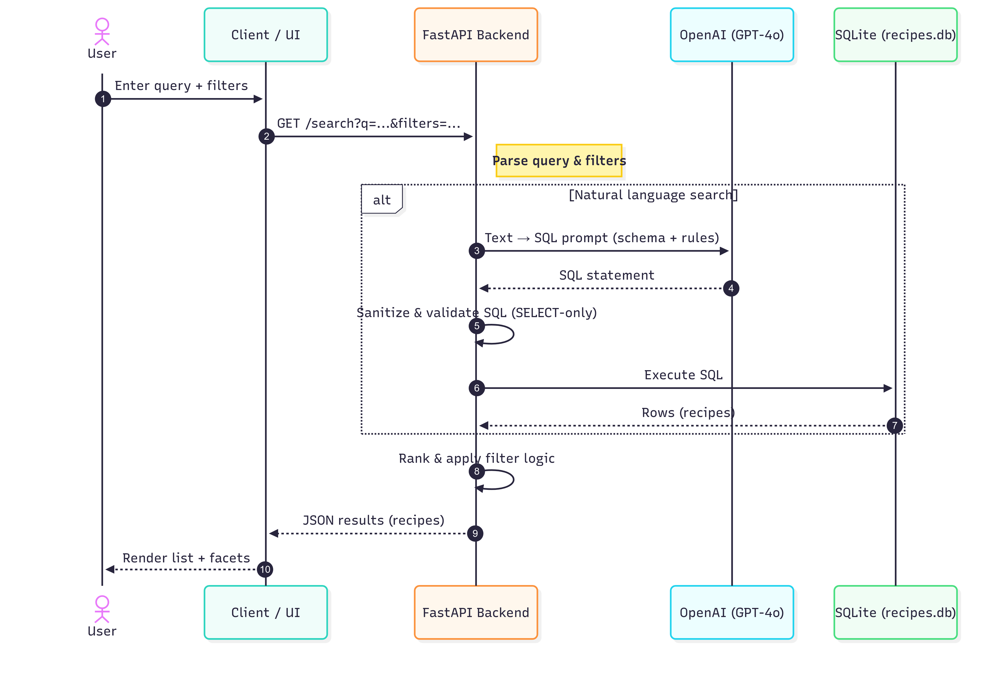

# 🍲 Recipe Finder AI App

[](https://www.python.org/)
[](https://www.sqlite.org/)
[](LICENSE)

An **AI-powered Recipe Finder App** that stores recipes in a database and lets you query them using natural language.  
Built with **Python + SQLite**, designed to easily extend into **PostgreSQL + AI embeddings** in the future. 🚀

---

## ⚡ Features
- ✅ Load recipes from a JSON dataset into SQLite  
- ✅ Clean schema with `title`, `ingredients`, `cuisine`, `ratings`, etc.  
- ✅ Fast database setup with `init_db.py`
- ✅ API (FastAPI) endpoints for `/search`
- 🔜 Semantic search with embeddings (OpenAI or Hugging Face)  

---

## System Design



##  Prerequisites

- Python 3.9–3.13 installed
- An OpenAI account and API key (for the Text-to-SQL demo)
- (Recommended) Git and a terminal

### 🔐 OpenAI API Key

Create an API key from your OpenAI dashboard.
```
Login to Open AI -> https://platform.openai.com/settings/profile/api-keys

Click "+ Create a new secret key" -> Name your key for e.g.:- "My demo key" -> Copy the generated key 

This key will be used to be pasted in .env file
```
In the project root, create a .env file and this one line **( Just replace "sk-your-key-here" with your generated key , just paste it as it is no need to use "")**:
```
OPENAI_API_KEY=sk-your-key-here
```
Tip: Never commit your key. .env is git-ignored.

## 🚀 Getting Started

### 1. Clone the repo
```
git clone https://github.com/PaurushVishnoi/recipe-finder-ai.git
cd recipe-finder-ai
```

### 2. Setup environment
```
pip install -r requirements.txt
```

### 2. Build the database
```
cd scripts 

python init_db.py
```

This creates recipes.db from recipes-en.json.

### 3. Run the app 

Open the local host ( link ) :-
```
http://127.0.0.1:8000/
```


### 🥳 You are good to cook now! 🔥🍳🥗